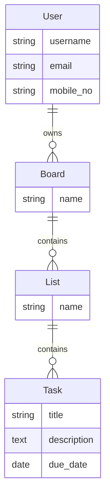

## Database Schema

The database schema of the Task Management System consists of the following tables:

- **User**: Represents user information including username, email, and mobile number.
- **Board**: Stores information about boards, which are containers for lists of tasks.
- **List**: Represents lists of tasks within boards.
- **Task**: Contains information about individual tasks including title, description, assigned list, assigned users, and due date.

