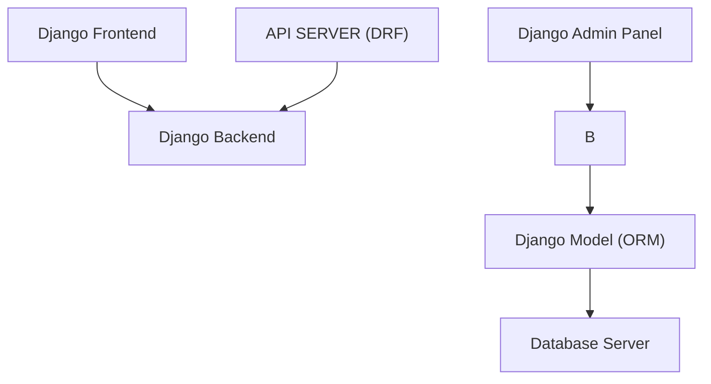

# Project Architecture

The Task Management System follows a typical client-server architecture, with a frontend application communicating with a backend API server. Here's an overview of the architecture:

## Backend Architecture

B --> C["Database"];
B --> D["Models"];
B --> E["Views and Serializers"];
B --> F["Customized Django Admin Panel"];

- **Django Frontend**: The frontend is built using Django, a high-level Python web framework that facilitates rapid development and clean, pragmatic design.
- **Django REST Framework (DRF)**: DRF is used to build the RESTful API endpoints that handle communication between the frontend and backend.
- **Database**: Django ORM is utilized to interact with the underlying relational database. PostgreSQL is the preferred choice for its robustness and scalability, but other databases supported by Django can also be used.
- **Models**: The backend consists of Django models that define the structure of the database schema. These models include User, Board, List, and Task, as outlined in the Database Schema section.
- **Views and Serializers**: Views are implemented using Django views or viewsets, while serializers handle the conversion of Django model instances to JSON format for API responses.
- **Customized Django Admin Panel**: A customized Django admin panel is developed to provide administrative access for managing users, boards, lists, tasks, and other application entities.

## Frontend Architecture

- **Django Frontend**: The initial frontend is built using Django templates and Jinja, providing a traditional server-rendered user interface. It serves as a demonstration of Django frontend development skills.
- **Vue.js Frontend (Future)**: There are plans to migrate to a Vue.js-based frontend in the future for improved interactivity and user experience. This frontend will be built using Vue.js components, pinia for state management, and Vue Router for client-side routing.
- **Components**: Frontend components are organized using Django templates for the Django frontend and Vue.js components for the Vue.js frontend. Each component is responsible for rendering a specific part of the user interface.
- **State Management**: Vuex is used for state management in the Vue.js frontend, while Django templates handle state management in the Django frontend.

## Communication

- **RESTful API**: Both frontend applications communicate with the backend through RESTful API endpoints provided by Django REST Framework. These endpoints handle CRUD (Create, Read, Update, Delete) operations for tasks, boards, lists, and users.
- **HTTP Protocol**: Communication between the frontend and backend occurs over HTTP protocol, with JSON payloads exchanged between client and server.

## Deployment Architecture

- **Containerization**: The application is packaged into Docker containers to ensure consistency across different environments and simplify deployment.
- **GitHub Container Registry**: Docker images are stored in the GitHub Container Registry, providing a centralized location for version-controlled images.
- **CI/CD Pipeline**: Continuous Integration and Continuous Deployment (CI/CD) pipelines are implemented using GitHub Actions, automating the build, testing, and deployment processes.

## Scalability Considerations

- **Horizontal Scaling**: The architecture is designed to support horizontal scaling by deploying multiple instances of the backend API server behind a load balancer to distribute incoming traffic.
- **Database Sharding**: As the application grows, database sharding techniques can be employed to distribute database load across multiple database servers.

## High-Level Overview

The Task Management System architecture consists of a Django backend providing RESTful API endpoints, a Django frontend for server-rendered UI, a Vue.js frontend for interactive UI (future), and communication between them through HTTP protocol. The application also includes a customized Django admin panel for administrative tasks. Docker containers, GitHub Container Registry, and CI/CD pipelines are used for deployment and automation.

This architecture ensures modularity, scalability, and maintainability, making it well-suited for both small-scale deployments and future growth.
